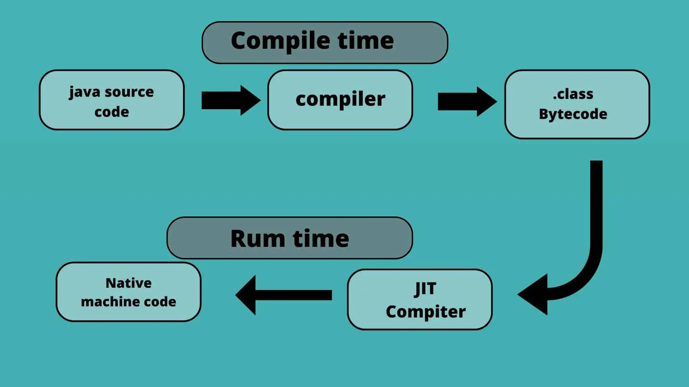
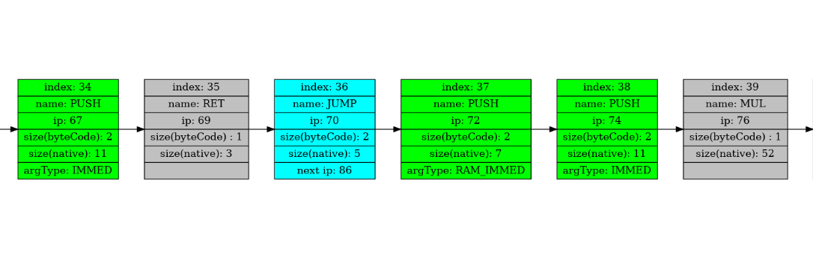

# JIT-Compiler

## Introduction

This projects is the final part of I.R.Dedinskiy programming course (1st year MIPT DREC).

**Goals**: 

1) Design the algorithm of binary translation from my own assembly generated byte code to x86-64 machine code.
2) Implement the JIT-compiler for my own programming language.
3) Measure the performance boost relative to the my own CPU implementation.

## JIT-compiler in general

In a bytecode-compiled system, source code is translated to an intermediate representation known as bytecode. Bytecode is not the machine code for any particular computer, and may be portable among computer architectures. 

JIT (stands for just-in-time) compiler is a runtime environment component that dynamically compiles the source code (byte code more often) directly to machine code of native cpu and executes it. By contrast, a traditional interpreted virtual machine will simply interpret the bytecode, often with much lower performance.

JIT is used in implementations of Java (JRE), JavaScript, the .NET Framework, and one of the Python implementations, PyPy.

 \
[img src](https://www.hindimeit.com/wp-content/uploads/2022/09/what-is-jit-compiler-explain-in-hindi.jpg)

Check the link below to learn more about JIT:
https://en.wikipedia.org/wiki/Just-in-time_compilation

## Intermediate Representation

As it was said before, the byte code itself is an intermediate representation (**IR**), but to make the translating process more convenient and easy would be reasonable to add yet another form of it. 
Specifically, an array of structures that contain all the necessary data for binary translation. 

To visualize this array I used [graphviz](https://graphviz.org/) - decent open source graph visualization software. \
Here is the example of the IR i used:

 

Now as the IR is done, it's time to generate some machine code!

## Binary Translation

Our plan is to fill the specially allocated array with machine code produced via binary translation. Then give this array execution rights with the mprotect function and then run our program. 

First of all worth noting that my own CPU implementation only operates with integer numbers. Floating point numbers are stored and computed as multiplied by 1000 (1.125 stored as 1125). In order to level the playing field, i decided to stick with this general storing-computing approach in my binary translator, but at the same time i wanted to use some real floating point calculations using xmm registers.

**Short foreword**: the result of each operation is being pushed in stack. Then, for the next operations it can be popped in registers (for add, sub, cmp etc.) or stored in memory. 

So, there are some quite simple translations, when 1 cmd translates into 1-2 x86 commands:


|   virtual       | x86-64      |  
| ------          | :---------------: | 
|``` Add  ```     | ``` add reg, reg  ```     |
|``` Sub  ```     | ``` sub reg, reg  ```     |
|``` push 10  ``` |<p style="text-align: center;"> ``` mov rax, 10 ``` <br> ``` push rax ```   </p>                            |
|``` pop [10]  ```| ``` pop [r15 + 10*8]  ``` |


**Note**: in r15 i decided to store memory pointer. So, each command with brackets [x] will be translated into [r15 + 8*x].

The conditional jumps are translated straight forward:

|   virtual       | x86-64      |  
| ------          | :---------------: | 
|``` JXX label  ``` |<p style="text-align: left;"> ``` cmp reg, reg ``` <br> ``` JXX addrDiff ```   </p>                       |

Where addrDiff - 32bit difference between destination address and address of the first command after the jump cmd (including the relAddr itself).

<details>

<summary>Example of conditional jump translation</summary>

~~~C++

void TranslateCondJump(IR_HEAD_T* IR_HEAD, X86_CODE_T* X86_CODE) {

    assert(IR_HEAD != NULL);
    assert(X86_CODE != NULL);

    log("\n#in TranslateCondJump\n\n");

    size_t curIndex = IR_HEAD->currentIndex;
    int nativeNum = IR_HEAD->ir_StructArr[curIndex].nativeNum;
    int32_t addrDiff = IR_HEAD->ir_StructArr[curIndex].SpecArg.JumpInfo.addrDiff;
    u_int64_t jmpMask = IR_HEAD->ir_StructArr[curIndex].SpecArg.JumpInfo.jumpMask;

    EMIT(POP_REG | RAX, GET_X86_SIZE(POP_REG));
    EMIT(POP_REG | RBX, GET_X86_SIZE(POP_REG));
    EMIT(CMP_REG_REG | FIRST_G(RAX) | SECOND_G(RBX), GET_X86_SIZE( CMP_REG_REG));
    EMIT(x86_COND_JMP| J_MASK(jmpMask),              GET_X86_SIZE(x86_COND_JMP));
    WriteImmed32(X86_CODE, addrDiff);
}
~~~

</details>


Now let's move on to something more interesting. As it was said above, i wanted to save manipulating with multiplied by 1000 integers and yet implement some true floating point calculations. 

So, i decided to stick with something like that: 

|   virtual       | x86-64      |  
| ------          | :---------------: | 
|``` MUL  ``` |<p style="text-align: left;"> ``` cvtsi2sd xmm0, [rsp] ``` <br> ```cvtsi2sd xmm1, [rsp + 8]```  <br> ``` add rsp, 16 ``` <br> ```mov rax, 1000``` <br> ```cvtsi2sd xmm2,rax``` <br> ```divpd xmm0, xmm2``` <br> ```divpd xmm1, xmm2``` <br> ```mulpd xmm0, xmm1``` <br> ```mulpd xmm0, xmm2``` <br> ```cvtsd2si rax, xmm0``` <br> ```push rax```</p>                       |

Well, maybe it turned out a little complicated...

The div and sqrt commands are similar to this. All of them are using xmm's registers. 

As for the most interesting commands (i mean OUT and IN), here i decided to use standard printf/scanf functions. But in order to call them, we must know exactly where in the executable file they are located. Here the so called "wrappers" come to the rescue: let's just write the function in "C" the only purpose of which is to call the standard printf/scanf function. And now we can use the pointer to that function to calculate the difference between it and the place where we are going to call it. 

Here they are: 

~~~C++
void IntScanfWrap(int* num) {
    printf("Enter an integer number: ");
    scanf("%d", num);
    *num *= 1000;
}

void DoublePrintfWrap(double num) {
    printf("OUTPUT: %.3lf\n", num / 1000);
}
~~~

Now addrDiff can be easily calculated like this:

~~~C++
int32_t addrDiff =
(u_int64_t) DoublePrintfWrap - (u_int64_t)(X86_CODE->BinaryCode + AdrToContinue);
~~~

Where BinaryCode is the beginning of our array with machine code.

So, we ran through the main aspects of the translation, and now let's run some tests!

## Testing

First let's run a program that solves a quadratic equation with given coefficients. \
We will calculate the mean time of 10 trials, each trial consists of 10000 runs with the same coefficients. 

Here are the results:

**Quadratic equation:**

|  | my CPU       | x86-64                 |  
| :------: | :------:  | :---------------: | 
| mean Time (ms) | 454,3  | 30,5 $\pm$ 5                 |  
| Relative boost | 1       | 14,9 $\pm$ 0.1                | 

Now let's run the program which calculates the factorial of given number.

**Factorial:**

|  | my CPU       | x86-64                 |  
| :------: | :------:  | :---------------: | 
| mean Time (ms) | 346,9   | 17,3 $\pm$ 5                 |  
| Relative boost | 1       | 20,1 $\pm$ 0.1                | 


## Conclusion

As we can see, JIT implementation has really sped up both of our programs. \
I think it's worth noticing that the real JIT-compilers don't always translate the whole byte code as we did. Usually during the runtime JIT determines the most frequently used code and compiles it. Depending on the compiler, this can be done on a method or smaller section of code. \
The more code JIT translates, the more startup delays it will cause.
